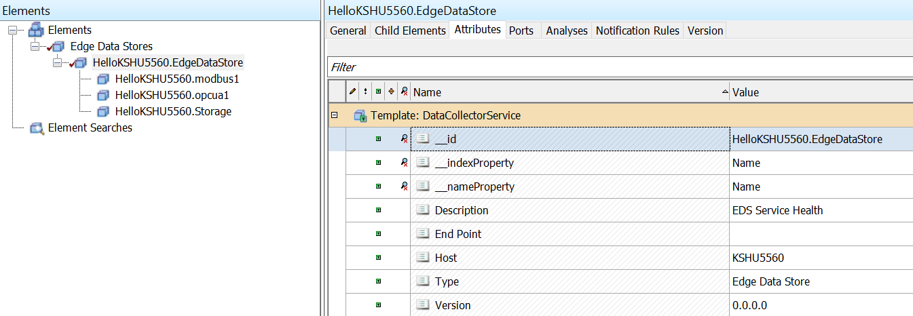

# Edge Data Store health

Edge Data Store and its components produce health information to provide insight into their status, which is critical for monitoring data collection. When configured, EDS transfers health information to OMF endpoints, including the types and containers that represent available health information. To enable this functionality, configure one or more health endpoints.

EDS also produces diagnostic data. You can use diagnostic data to find more information about a particular component instance. Diagnostic data lives alongside the health data and you can egress it using a health endpoint and setting `EnableDiagnostics` to `true`. You can configure `EnableDiagnostics` in the system configuration. For more information on available adapter diagnostics data, see [Diagnostics configuration](xref:EdgeDataStoreDiagnostics).

## EDS adapter health

The following health types and streams are created to reflect the health of EDS adapters.

**Note:** If a Health prefix is assigned in System_General's Health Prefix field (xref: GeneralConfiguration), all streams will be prefixed with `{HealthPrefix}`.

The EDS static type includes these properties and servers as a root AF element with the ID.

| Property     | Type     | Description      |
|--------------|----------|------------------|
| Id | string | Edge Data Stores - root AF element |
| Description | string | Collection of Adapter assets |

### EDS adapter component health

The DataCollectorService static type includes the following properties, which are logged in a stream with the ID `{machinename}.{EdgeDataStore}`. The stream is linked to root AF element (Adapters).

| Property     | Type     | Description      |
|--------------|----------|------------------|
| Id           | string  | {machinename}.EdgeDataStore |
| Description  | string | EDS Service Health |
| Type         | string | Edge Data Store |
| Version      | string | {EDS Version} |

### Device status

The DeviceStatus dynamic type includes the following values, which are logged in a stream with the ID Adapters.`{machinename}.{componentid}.DeviceStatus`. The stream is linked to `{machinename}.{componentid}` static stream.

| Property     | Type     | Description      |
|--------------|----------|------------------|
| Time | string | Timestamp of event |
| DeviceStatus | string | Device status value |

### Next health message expected

The NextHealthMessageExpected dynamic type includes the following values, which are logged in a stream with the ID `Adapters.{machinename}.{componentid}.NextHealthMessageExpected`. The stream is linked to `{machinename}.{componentid}` static stream. Heart beat message is expected once a minute.

| Property     | Type     | Description      |
|--------------|----------|------------------|
| Time         | string | Timestamp of event |
| NextHealthMessageExpected | string | Time when next health message is expected. |

### Storage health

The Storage Health static type includes the following properties, which are logged in a stream with the ID `{machinename}.Storage`. The stream is linked to Edge Data Store's service element `{machinename}.EdgeDataStore`.

| Property     | Type     | Description      |
|--------------|----------|------------------|
| Id           | string   | `{machinename}.Storage` |
| Description  | string   | Storage health |
| Host         | string   | `{machinename}` |
| Version      | string   | `{storageversion}` |

### Storage device status

The DeviceStatus dynamic type includes the following values, which are logged in a stream with the ID Storage.`{machinename}.DeviceStatus`. The stream is linked to `{machinename}.Storage` static stream.

| Property     | Type     | Description      |
|--------------|----------|------------------|
| Time | string | Timestamp of event |
| DeviceStatus | string | Device status value |

### Storage next health message expected

The NextHealthMessageExpected dynamic type includes the following values, which are logged in a stream with the ID `Storage.{machinename}.NextHealthMessageExpected`. The stream is linked to `{machinename}.Storage` static stream. Heart beat message is expected once a minute.

| Property     | Type     | Description      |
|--------------|----------|------------------|
| Time | string | Timestamp of event |
| NextHealthMessageExpected | string | Time when next health message is expected. |

Example health strucutre:
