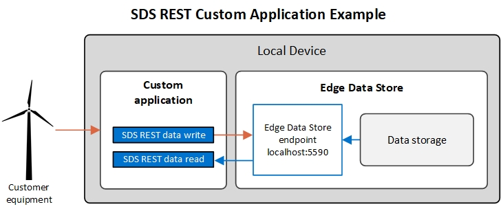

# SDS quick start  

Create a custom application using Sequential Data Store (SDS) REST API to send data to Edge Data Store from sources that cannot use Modbus or OPC UA protocols.

The following diagram depicts the data flow from an SDS custom application into EDS:



The SDS application collects data from a data source and sends it to the EDS endpoint. The EDS endpoint sends the data to the storage component where it is held until it can be egressed to permanent storage in PI Server or AVEVA Data Hub. All data from all sources on EDS can be read using the SDS REST APIs on the local device in the default tenant and the default namespace.

To get started using the SDS REST API to ingress data into EDS, create an SDS type and stream and then write data events to the SDS stream. Use the Sequential Data Store (SDS) REST API to read the data back from EDS.

## Create an SDS type

To create an SDS type that describes the format of the data to be stored in a container:

1. Create a JSON file using the example below:

   ```json
   {
       "Id": "Simple",
       "Name": "Simple",
       "SdsTypeCode": 1,
       "Properties": [
           {
               "Id": "Time",
               "Name": "Time",
               "IsKey": true,
               "SdsType": {
                   "SdsTypeCode": 16
               }
           },
           {
               "Id": "Measurement",
               "Name": "Measurement",
               "SdsType": {
                   "SdsTypeCode": 14
               }
           }
       ]
   }
   ```

   **Note:** The data to be written is a timestamp and numeric value. It is indexed by a timestamp, and the numeric value is a 64-bit floating point value.

1. Save the JSON file the name `SDSCreateType.json`.

1. Run the following curl script from the directory where the file is located:

   ```bash
   curl -d "@SDSCreateType.json" -H "Content-Type: application/json"  -X POST   http://localhost:5590/api/v1/tenants/default/namespaces/default/types/Simple
   ```

   When this script completes successfully, an SDS type with the same name is created on the server. You can create any number of containers from a single type, as long as they use a timestamp as an index and a 64-bit floating point value. The Type definition needs to be sent first before you send data with a custom application. It does not cause an error to resend the same definition at a later time.

## Create an SDS stream

To create an SDS stream:

1. Create a JSON file using the example below:

   ```json
   {
       "Id": "Simple",
       "Name": "Simple",
       "TypeId": "Simple"
   }
   ```

   **Note:** This stream references the type you created earlier. An error occurs if the type does not exist when the stream is created. As with an SDS type, create a stream once before sending data events. Resending the same definition repeatedly does not cause an error.

1. Save the JSON file with the name `SDSCreateStream.json`.

1. Run the following curl script from the directory where the file is located:

   ```bash
   curl -d "@SDSCreateStream.json" -H "Content-Type: application/json"  -X POST http://localhost:5590/api/v1/tenants/default/namespaces/default/streams/Simple
   ```

   When this script completes successfully, an SDS stream is created on the server to store data defined by the specified type.

## Write data events to the SDS stream

After you create a type and container, follow these steps to use SDS to write data to a stream:

1. Create a JSON file using the example below:

   ```json
   [{
       "Time": "2017-11-23T17:00:00Z",
       "Measurement": 50.0
   },
   {
       "Time": "2017-11-23T18:00:00Z",
       "Measurement": 60.0
   }]
   ```

   **Note:** This example includes two data events that will be stored in the SDS Stream created in the previous steps. For optimal performance, batch SDS values when writing them.

1. Save the JSON file with the name `SDSWriteData.json`.

1. Run the following curl script from the directory where the file is located:

   ```bash
   curl -d "@SDSWriteData.json" -H "Content-Type: application/json"  -X POST http://localhost:5590/api/v1/tenants/default/namespaces/default/streams/Simple/Data
   ```

   When this script completes successfully, two values are written to the SDS stream.

## Read last data written using SDS

To use the SDS REST API to read back the last data event written to the server:

1. Start the curl command line tool.

1. Run the following curl command to return the last value written:

   ```bash
   curl http://localhost:5590/api/v1/tenants/default/namespaces/default/streams/MyCustomContainer/Data/Last
   ```

   Sample output:

   ```json
   {"Timestamp": "2019-07-16T15:18:25.9870136Z", "Value": 12346.6789}
   ```

## Read a range of data events written using SDS

To use the SDS REST API to read back the a range of data written to the server:

1. Start the curl command line tool.

1. Run the following curl command to return up to 100 values after the startIndex specified:

   ```bash
   curl "http://localhost:5590/api/v1/tenants/default/namespaces/default/streams/MyCustomContainer/Data?startIndex=2017-07-08T13:00:00Z&count=100"
   ```

   Sample output:

   ```json
   [{"Timestamp": "2019-07-16T15:18:24.9870136Z","Value": 12345.6789}, {"Timestamp": "2019-07-16T15:18:25.9870136Z", "Value": 12346.6789}]
   ```

   Both values that were entered are returned. This command returns up to 100 values after the specified timestamp.
